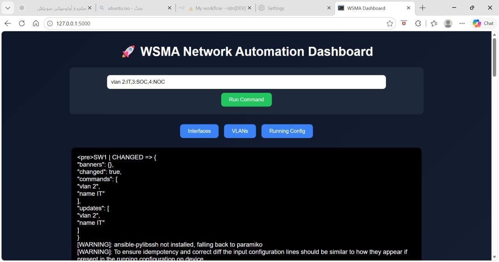
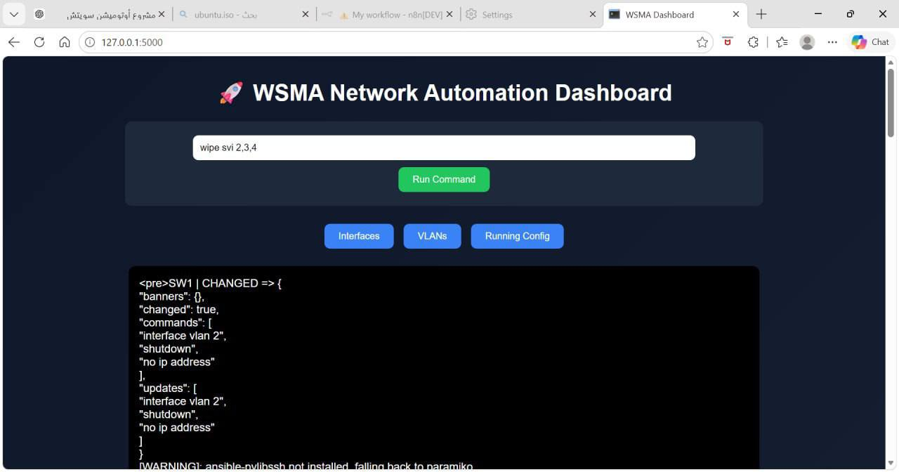
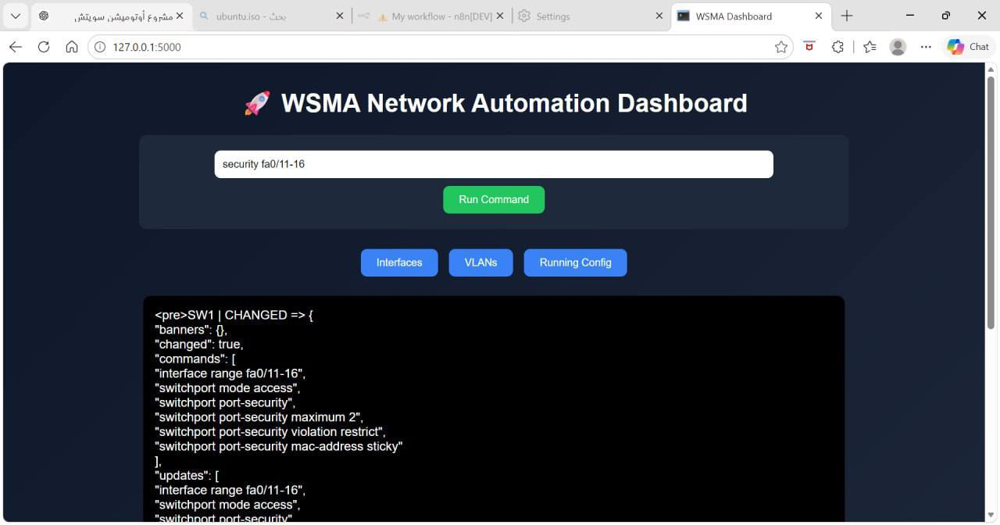
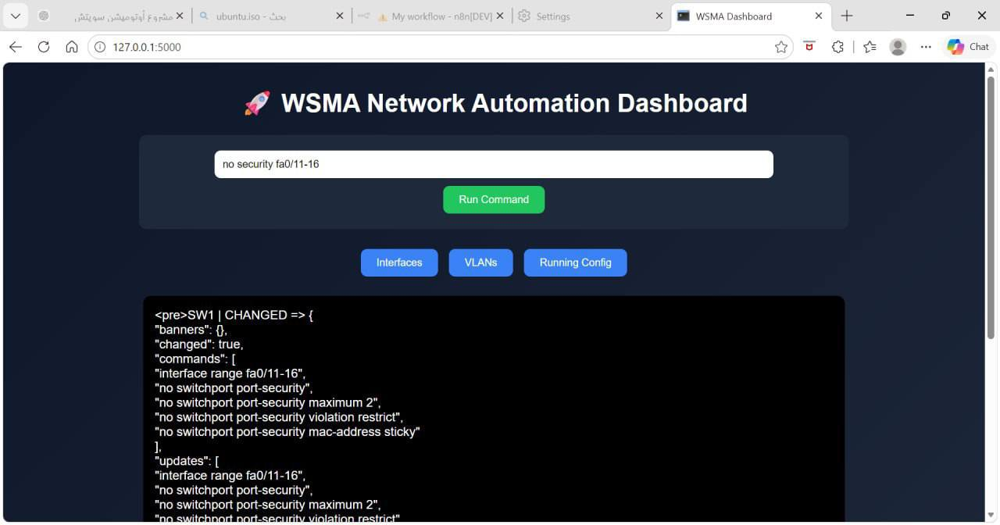
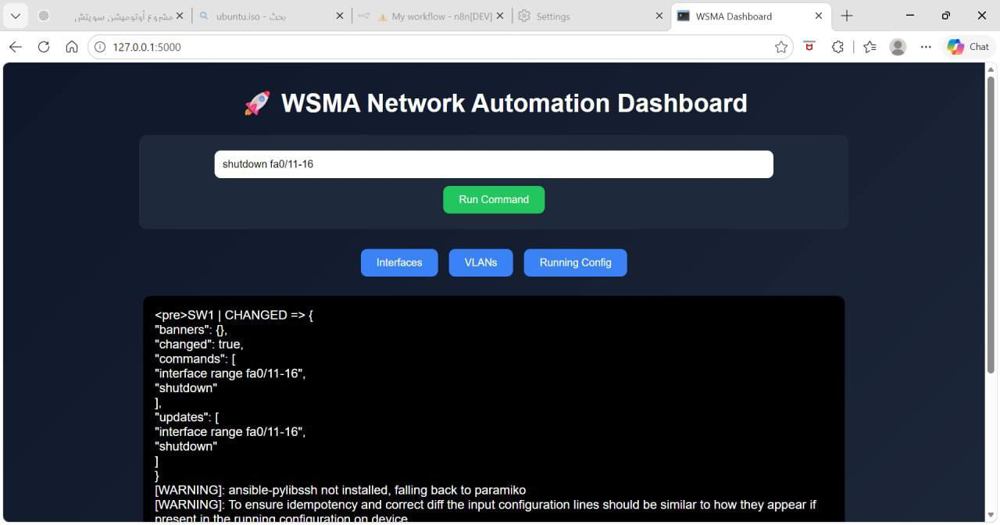

# WSMA – Web-Based Switch Management Automation

WSMA is a network automation solution built to streamline the way 
Cisco switches are configured and maintained. Instead of relying on 
manual command-line entry for every device, the system uses Ansible 
to push configurations through a simple web-based dashboard, cutting 
down on repetitive work and reducing the chance of human error across 
the network.

The tool connects to switches over SSH and lets administrators trigger 
common configuration tasks directly from the interface.

## Dashboard Overview

The dashboard lets users run configuration commands directly and see 
real-time Ansible output for each executed task.

## What It Does

VLAN Management

- Deploys multiple VLANs at once instead of one-by-one
- Automates VLAN setup and removal across Cisco devices

Port Security

- Applies Port Security settings on selected interfaces
- Supports enabling and disabling security policies per port range

Interface Control

- Enables/disables switch ports (shutdown / no shutdown)
- Runs pre-built configuration templates for common scenarios

- Manages devices remotely via Ansible over SSH
- Delivers all of this through a browser-based interface

## Built With
Ansible · Cisco IOS · Ubuntu Linux · SSH · Python · Git/GitHub

## Planned Next Steps
- Backup/restore functionality for configurations
- Integration with n8n for extended workflow automation
- Role-based user access control
- Stronger web-layer security
- Logging and monitoring dashboard

## Team
Ameera Albalawi, Sara Alshehri, Madeeha Alotaibi, Wadha Alharbi  
*Advanced Networking Technology Bootcamp — Tuwaiq Academy*
